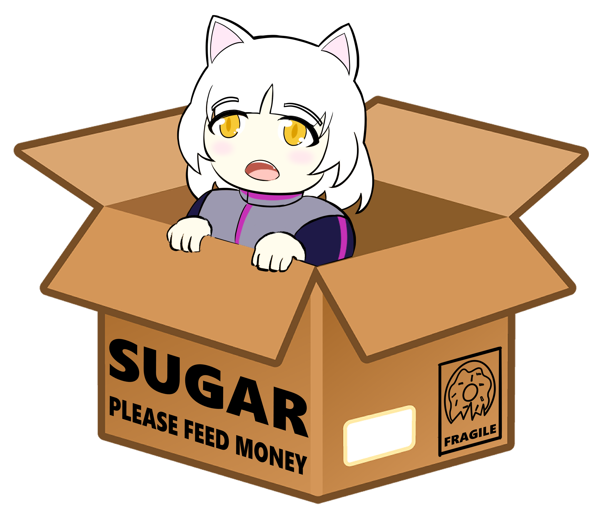

# Sugar Bot


Totally not another hobby project to explore stuffs.

This repository contains 2 main components : A web server and a Discord bot.

## Why?

I want to explore stuffs. Also there is this library called `fastify` and really caught my attention, so yeah.

Oh yeah, I made several bots before but I realized on how messy the codes were (not that the current one ain't). I want to rewrite the bot while trying to keep up with current best practices.

## Architecture(?)

Everything is composed inside `src` directory, including the bot and the web server. Basically anything that's going to be executed by default will have it's implementation lies inside `src` directory. Other things like convenience scripts would happen in `scripts` folder, if any.

Inside `src` lies the common stuff you'll see when creating web server. An `index.ts` file that will be the entrypoint, `interfaces` directory for storing types and interfaces used in the project, and probably any other additional directories if needed, such as `models` or `lib`.

The only exception is the `bot` directory which contains the entire implementation of the bot. Currently only Discord bot lies inside, but it is not impossible to expand to other platform, such as LINE. Anything regarding the bot should be only isolated to this directory.

### Stacks

-   `fastify` for web backend
-   `discord.js` for Discord bot
-   `@sapphire/framework` for bot command handler

## Usage

The application is containerized as Docker image where the definition lies in `Dockerfile` file. It only compiles everything inside `src` and spews out the output in `build` directory, then copied into the image where the "entrypoint" is `index.js` file. Simply build the image using docker and run with required environment variables. The list of environment variables will follow this section.

Running in development mode will not require Docker, but it's required to have `.env` file lies in the project root directory. Define all the required environment variables there. Start the app using the `dev` script defined in `package.json` and you're good to go.

### Environment variables.

| Variable Name       | Type   | Description                         |
| ------------------- | ------ | ----------------------------------- |
| `DISCORD_BOT_TOKEN` | string | Token used to login to Discord bot. |
| `DATABASE_URL`      | string | URL to Postgres Database used       |

## Contributing

If this is the first time you want to contribute, you need the following programs installed.

-   git
-   Node.js v16 or above
-   Text editor / IDE. I prefer VSCode

If this is the first time you attempt to code, you need the following additional programs installed.

-   Github Desktop

### Steps

1. Clone the repository. If you're using git from command-line / terminal, just copy the HTTPS link and do `git clone [the link]` on your terminal. If you're using Github Desktop, the button is there for you.
2. Open the project. If you're using VS Code, go to File > Open Folder... and choose the folder for this repository (should be "izuna" folder).
3. Open the terminal/command-line. Make sure it's current location is in the project directory.
4. Execute these commands from the terminal/command-line

```
yarn install
yarn build
```

5. If there is nothing wrong then you're ready to go. Create a new branch where you can work in peace by using the following command

```
git checkout -b "[yourname]-[feature]"
```

6. Make some changes. When you're done, add the changes, create commit, and push into the remote repo as new branch. In command line you can do this with.

```
git commit -am "insert commit message here"
git push origin "[yourname]-[feature]"
```

7. Open this repository again in the web. Go to "Pull request" tab and click on green button "New pull request".
8. Below the "Compare changes" title, there is a part about "base: master" <- compare: master" thingy. Change the latter into the recent branch name you've pushed. And then click on "Create Pull Request".
9. Your changes will be reviewed. If things are good, then congrats! You have contributed to this project! Nice!
